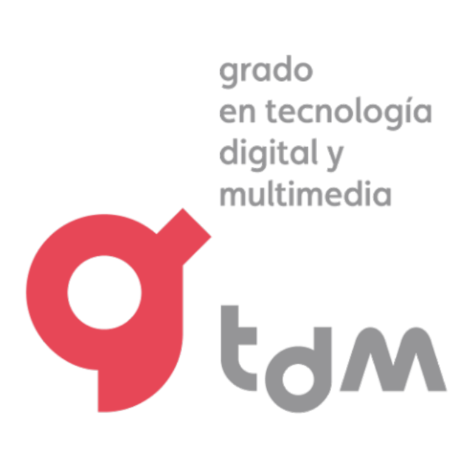

<!-- markdownlint-disable MD033 -->

Talleres y seminarios de tecnologías emergentes I 
Grado en Tecnología Digital y Multimedia

<h1 align="center" style="clear:both;">Repositorio <b>MaterialDeClase</b></h1>

<h4 align="center">
F. J. Martínez Zaldívar 
Departamento de Comunicaciones 
ETSIT-UPV
</h4>

# Contenido
Material empleado en clases de teoría y problemas de aula del taller-seminario  _"Control de versiones con Git y GitHub"_ de la asignatura _"Talleres y Seminarios de Tecnologías Emergentes I"_, en 2.º curso del Grado de Tecnología Digital Multimedia, curso 2024-25.

